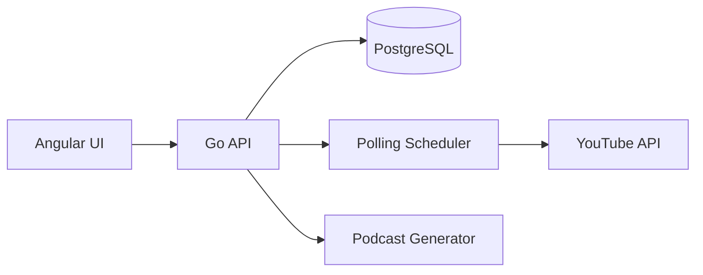

# Bytecast

[](https://go.dev/)
[](https://angular.io/)
[](https://www.postgresql.org/)
[](LICENSE)

ByteCast is an automated YouTube watchlist summarizer that converts your favorite channels' content into organized podcast summaries.

## Features

- **Smart Channel Management**: Add and manage your favorite YouTube channels with a user-friendly interface
- **Automated Content Detection**: Periodic polling system checks for new video uploads every 2 hours
- **Weekly Content Aggregation**: Collects and organizes new uploads over a 7-day period
- **Podcast Generation**: Converts video content into structured podcast format, organized by channel and video sequence

## System Architecture



## Tech Stack

- **Frontend**: Angular 19 with Spartan UI components
- **Backend**: Go 1.23.4 with Gin framework
- **Database**: PostgreSQL 17.4 with GORM
- **Development**: Docker & Docker Compose with hot reload support

## Getting Started

### Prerequisites

- Docker and Docker Compose
- Node.js (for local development)
- Go 1.23.4 (for local development)

### Development Setup

1. Clone the repository:
   ```bash
   git clone https://github.com/yourusername/bytecast.git
   cd bytecast
   ```

2. Set up environment variables:
   ```bash
   cp .env.example .env
   # Edit .env with your configuration
   ```

3. Start the development environment:
   ```bash
   docker-compose up
   ```

The application will be available at:
- Frontend: http://localhost:4200
- Backend API: http://localhost:8080

## Project Status

### Completed ✅
- Project structure and Docker setup
- Frontend and backend configurations
- Hot reload setup for development
- Basic health check endpoint

### In Progress 🚧
- Testing development environment
- Database connectivity
- Environment variables validation

### Upcoming 📋
- Docker optimizations
- Database schema design
- YouTube API integration
- Authentication system
- Channel management features

## Contributing

1. Fork the repository
2. Create a feature branch (`git checkout -b feature/amazing-feature`)
3. Commit your changes (`git commit -m 'Add amazing feature'`)
4. Push to the branch (`git push origin feature/amazing-feature`)
5. Open a Pull Request

## License

This project is licensed under the MIT License - see the [LICENSE](LICENSE) file for details.

## Acknowledgments

- [Spartan UI](https://github.com/spartan/ui) for Angular components
- [Air](https://github.com/cosmtrek/air) for Go hot reload
- YouTube Data API for content integration
